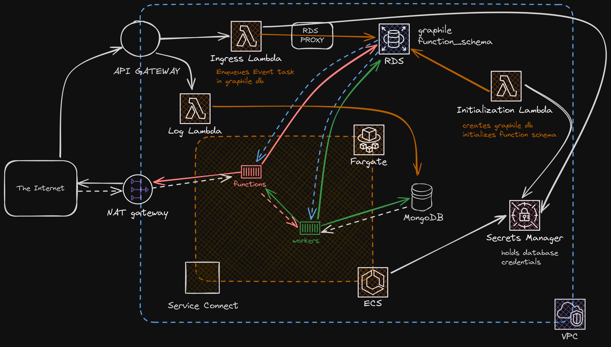

# reverb-infrastructure

This is the CDK project to deploy Reverb to AWS.

## Infrastructure



## Use

### Deployment

Prior to deploying make sure you have already:

- Configured aws cli to your account
- Installed cdk bootstrap
  - `npm install -g aws-cdk`
  - `cdk bootstrap`

Once you have have bootstrapped, all you need to do is:

```
npm install
npm run deploy
```

### Function Server Deployment

TODO: Add information about creating and deploy function service to infrastructure
