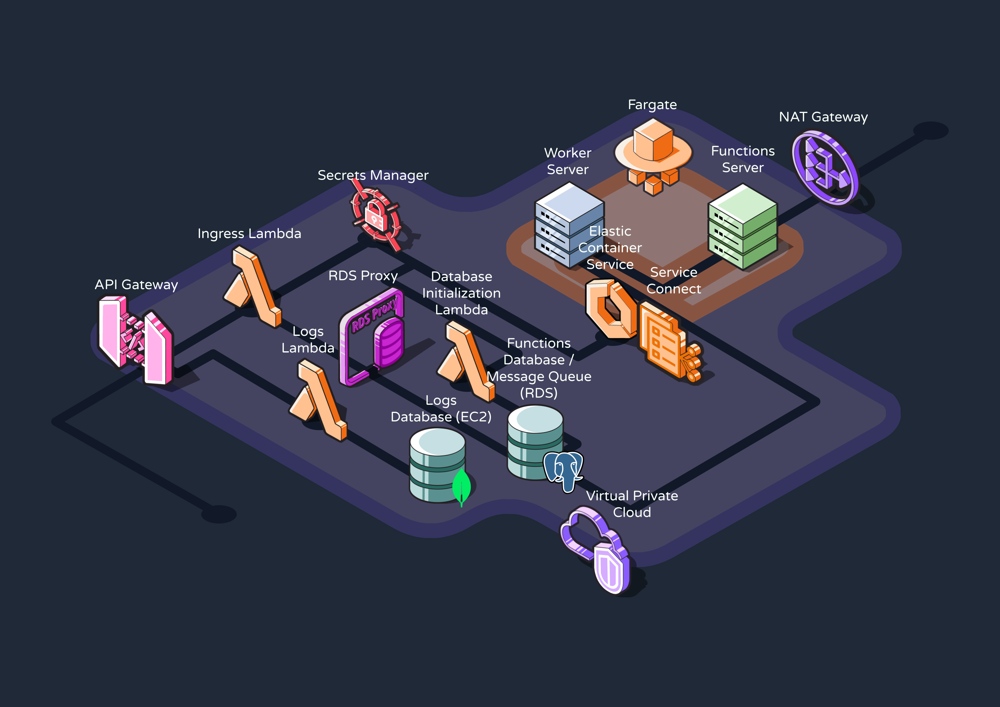

# reverb-infrastructure

This is the CDK project to deploy your Reverb workflow engine infrastructure to AWS.

## Infrastructure



## Use

### Deployment

Before deploying, make sure you have already:

- Configured the AWS CLI with your AWS account
- Installed the CDK bootstrap
  - `npm install -g aws-cdk`
  - `cdk bootstrap`

Once you have bootstrapped, all you need to do is run:

```
npm install
npm run deploy
```

### Function Server Deployment

TODO: Add information about creating and deploy function service to infrastructure
